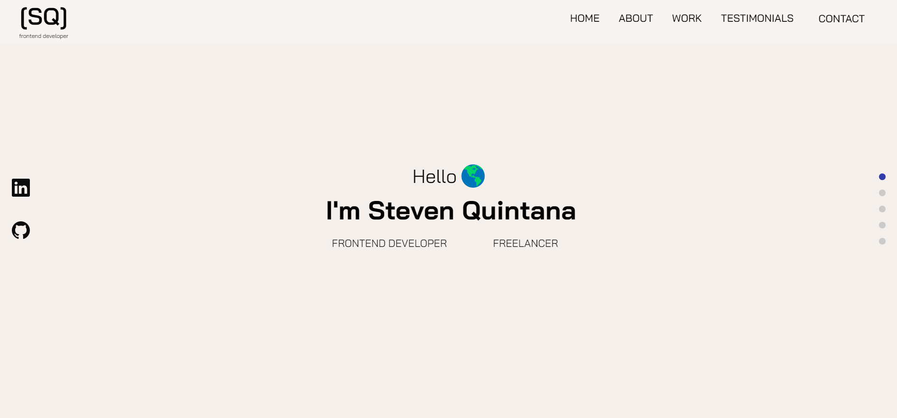

# Welcome to my portfolio! 👋👋👋👋

## Introduction

This is the code corresponding to the portfolio.

### Links

- Live Site URL: [https://steven-quintana-portfolio.netlify.app/](https://steven-quintana-portfolio.netlify.app/)

## My process

### Built with

It was made with react, javascript, sass and sanity for the backend.

- Semantic HTML5 markup
- SCSS (BEM)
- React
- Javascript
- Sanity (Backend)

### What I learned

## Author

- Website - [Steven Quintana](https://www.linkedin.com/in/stevenquintana/)
